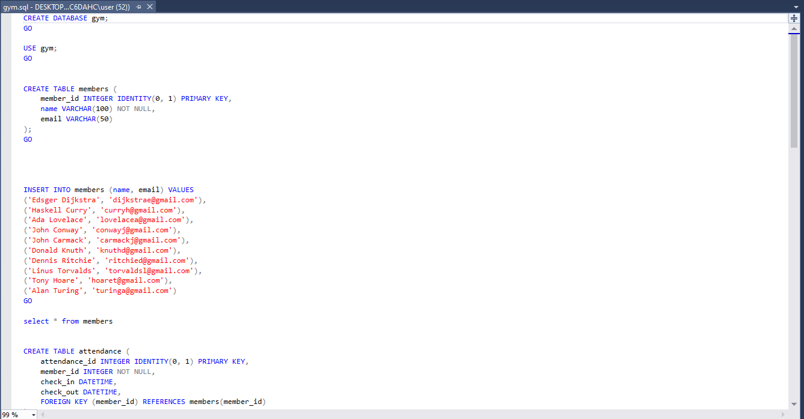
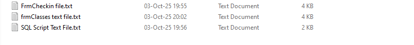
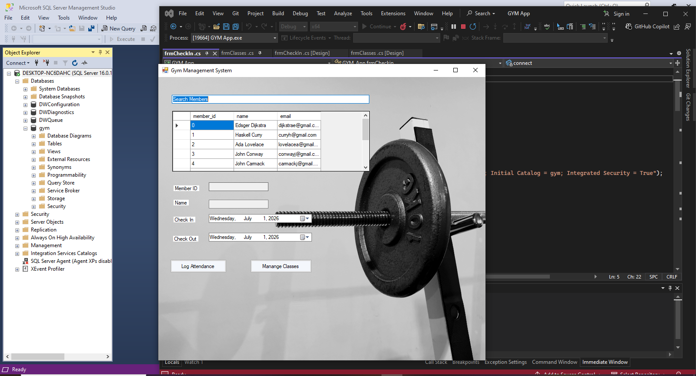
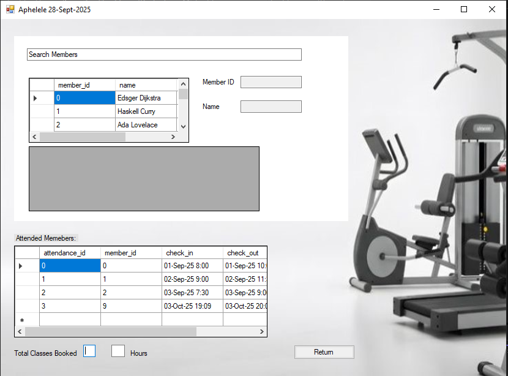

# GYM_Management_App
This is a windows forms app designed in C# and SQL that works to add, delete, log attendance and manage workout classes in a gym organizational environment  

<i>To get the app to work you need the sql database and tables created (instructions below)</i>

<h3>Step 1:</h3>

Open the <b>Gym.sln</b> file in Visual Studio and make sure the desktop name for your desktop server is the correct one in the <b><i>FrmCheckin</i></B> form (not mine lol, so change it to your desktop name)

<h3>Step 2:</h3>

In in <b><i>\GYM APP + SQL files\Resources</i></B> there is a <b>gym.sql</b> file that you can run to create database, tables and dummy records (if you wish), you opfcourse would need to do this section by section until you have the necccessary data to make the app work.

*Alternatively if the <b>gym.sql</B> file doesnt work, i did create text files you can use to create and copyall your database content from, you will find these at the  <b><i>\GYM APP + SQL</i></B> files folder:

<h3>Step 3:</h3>

Just make sure to connect your database desktop server and then run the app in VS

<h2> The App UI:</h2>
The final UI should look like this ( the log attendance button will redirect to another form for the attendance)

